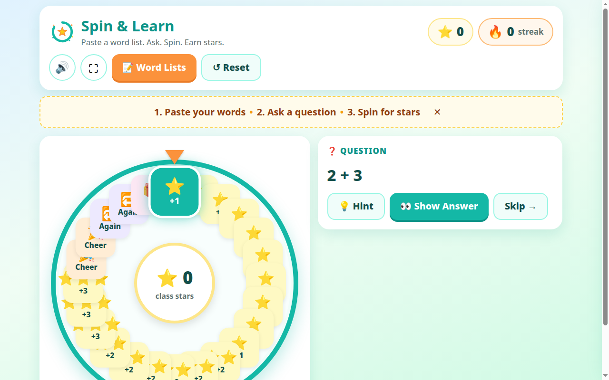
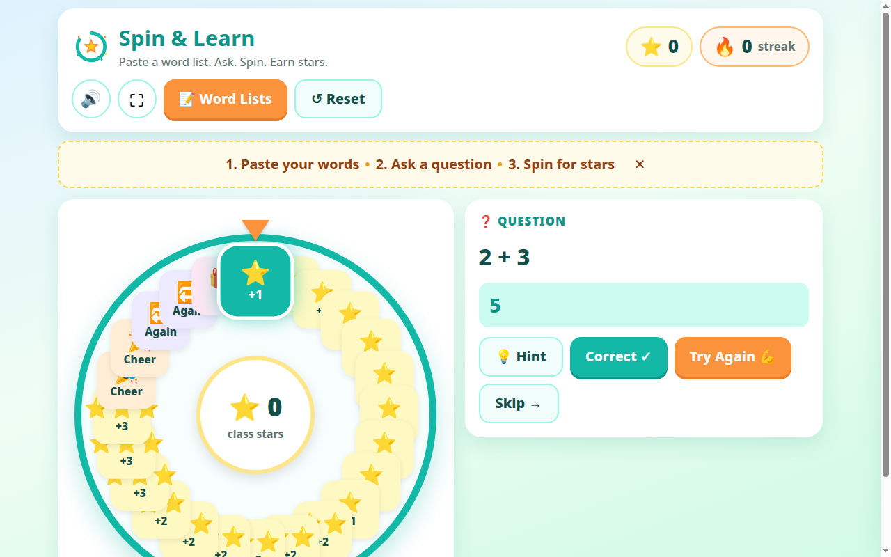
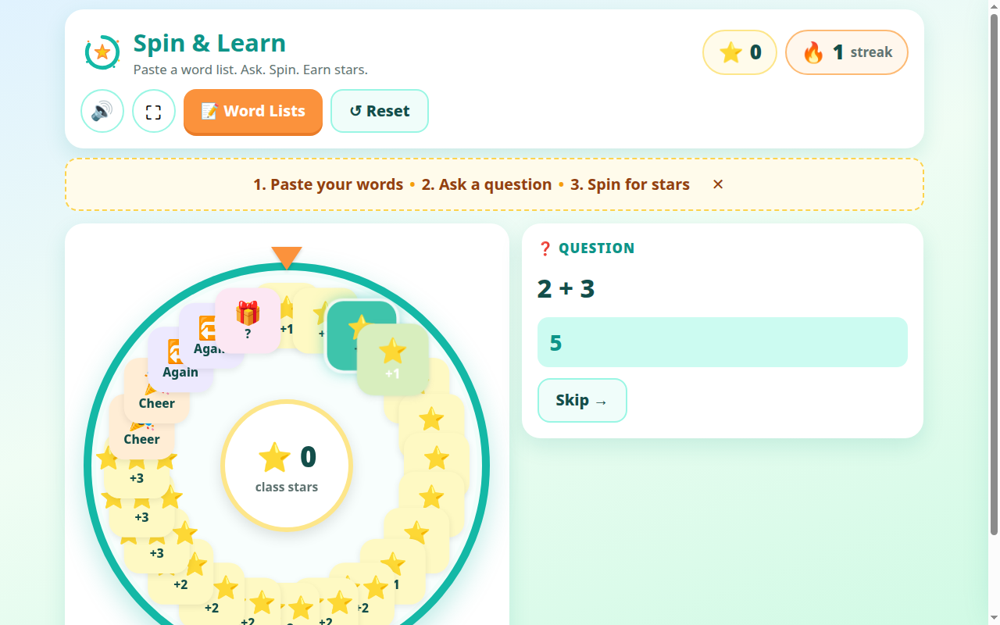
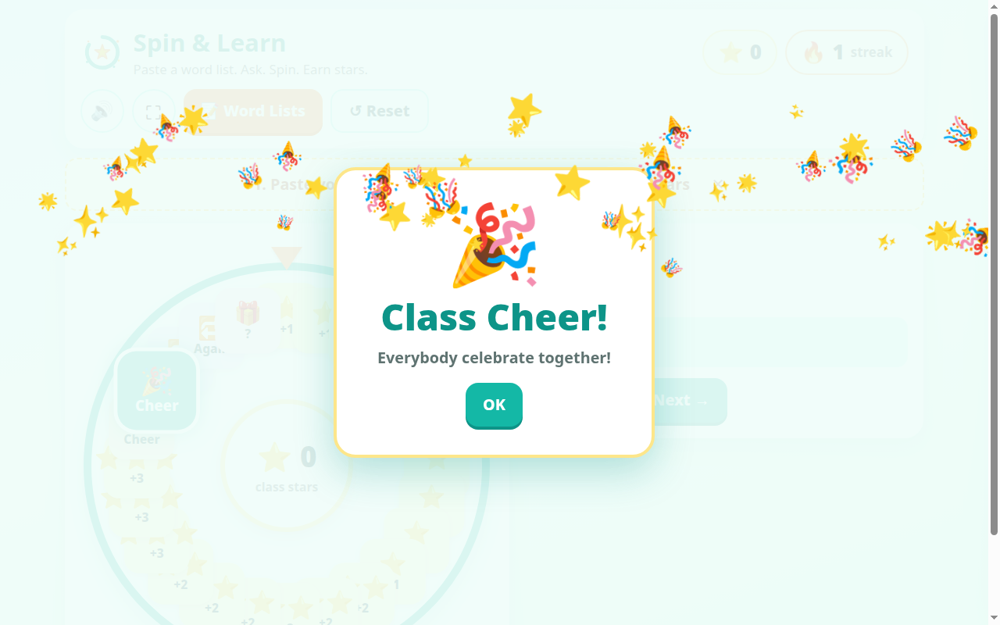
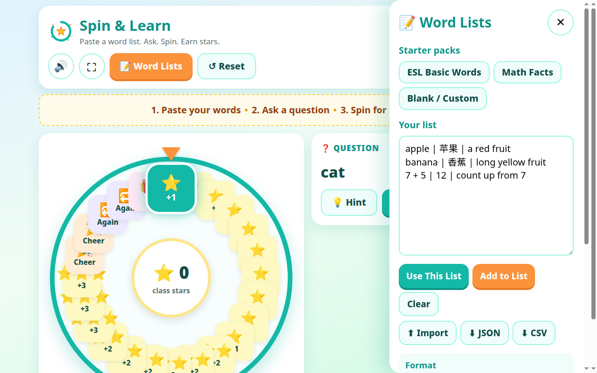

# Spin & Learn — Classroom Reward Spinner

**Paste a word list. Ask. Spin. Earn stars.**

A classroom reward game for teachers: you ask the question, a student answers, and on a correct answer the class spins the wheel and earns stars. No ads, no login, no student accounts — and it works fully offline.

🎮 **Live demo (free, no login):** https://ouyangthermal.github.io/spin-and-learn/



## How a lesson works

1. **Pick a pack or paste your list** — ESL Basic, Math Facts, or your own lines as `question | answer | hint`. Your list is saved in the browser automatically.
2. **Ask the class** — show the card, call on a student, reveal the answer when you like.
3. **Spin for stars** — correct answer? Spin the wheel. The class earns stars and builds a streak.






## What's inside

| | Free online demo | Paid download |
|---|---|---|
| Play in the browser, 3 built-in packs | ✅ | ✅ |
| Single-file offline HTML (double-click to run) | ❌ | ✅ |
| Printable teacher quick-start guide | ❌ | ✅ |
| Import / export word lists | ❌ | ✅ |
| All v0.x content-pack updates | ❌ | ✅ |

**Get the full version:** Personal Classroom License **$9** · Commercial/Creator License **$29** (modify it, publish and sell your own derivative games — see `product/LICENSE-COMMERCIAL.txt`).

## Project layout

```
index.html              # playable demo (this is what GitHub Pages serves)
css/style.css           # classroom theme — bright, no casino visuals
js/                     # classic scripts on window.SpinLearn: config, audio
                        # (100% WebAudio synth, zero MP3s), spinner (LightRunner
                        # adaptation), content, game state machine, editor
packs/                  # esl-basic.json, math.json, blank.json
PACK_FORMAT.md          # how to author new $3–9 theme packs (copy-paste schema)
build.py                # builds dist/spin-and-learn-standalone.html —
                        # ONE file, zero network requests, runs from file://
product/                # buyer-facing: README, licenses, Gumroad copy, FAQ,
                        # teacher guide (HTML+PDF), screenshots, demo GIF
```

Build the paid single file: `python3 build.py`

## Privacy

No accounts. No student names. Nothing is collected, stored, or sent anywhere. The game runs entirely in the browser.

## License

Demo/play: free. Redistribution of this repository's files is not permitted — see `product/LICENSE-PERSONAL.txt` and `product/LICENSE-COMMERCIAL.txt` for the paid terms.
